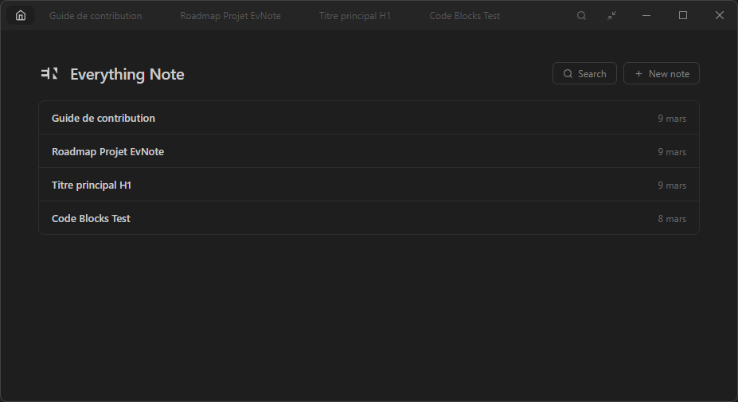

# Everything Note

A fast, keyboard-driven note-taking desktop app built with Angular, Electron, and SQLite.

<p align="center">
  
</p>

<p align="center">
  
</p>

## Features

- **Markdown editor** — CodeMirror 6 with live decorations (headings, bold, italic, code blocks, task lists)
- **Full-text search** — SQLite FTS5 for instant search across all notes
- **Command palette** — `F1` to search notes, commands, and tags
- **Tabs** — drag & drop reordering, pinning, session restore
- **Tag system** — organize notes with tags, filter from the sidebar
- **Keyboard-first** — every action has a shortcut (see below)
- **Local storage** — all data stays on your machine in a SQLite database

## Tech Stack

| Layer | Technology |
|-------|-----------|
| Frontend | Angular 19 (standalone components, signals, OnPush) |
| Editor | CodeMirror 6 with custom markdown decorations |
| Desktop | Electron 32 (frameless window, custom title bar) |
| Database | better-sqlite3 with FTS5, WAL mode, cached prepared statements |
| Build | electron-builder (NSIS installer), GitHub Actions CI/CD |

## Architecture

```
electron/
  main.ts            # Main process — window management, IPC handlers
  preload.ts         # Context bridge (electronAPI)
  database.ts        # SQLite schema, FTS5 triggers, CRUD operations

src/app/
  core/
    services/        # NotesService, TabsService, PaletteService, ShortcutsService
    models/          # TypeScript interfaces (Note, Tab, PaletteItem)
  features/
    editor/          # CodeMirror markdown editor with auto-save
    home/            # Note list with tag filtering & context menu
    tabs/            # Tab bar with drag & drop, pinning, window controls
    palette/         # Command/search/tag palette (F1 / Ctrl+Shift+F)
  shared/
    codemirror/      # VS Code Dark Modern theme, markdown decorations, widgets
    context-menu/    # Reusable context menu component
```

## Keyboard Shortcuts

| Shortcut | Action |
|----------|--------|
| `F1` | Command palette |
| `Ctrl+N` | New note |
| `Ctrl+W` | Close tab |
| `Ctrl+F` | Find in editor |
| `Ctrl+Shift+F` | Search all notes |
| `Ctrl+Tab` / `Ctrl+Shift+Tab` | Next / previous tab |
| `Ctrl+S` | Save note |
| `Ctrl+B` / `Ctrl+I` / `Ctrl+K` | Bold / italic / link |
| `Alt+P` | Pin/unpin tab |
| `Alt+Z` | Toggle wide mode |
| `Alt+Ctrl+1-9` | Jump to tab by index |

## Getting Started

### Prerequisites

- Node.js 20+
- npm

### Install & Run

```bash
# Install dependencies
npm install

# Rebuild native modules for Electron
npm run electron:rebuild

# Start in development mode (Angular dev server + Electron)
npm run dev
```

### Build for Production

```bash
# Build Angular + compile Electron TypeScript
npm run build

# Package as Windows installer (.exe)
npm run dist
```

## License

MIT
